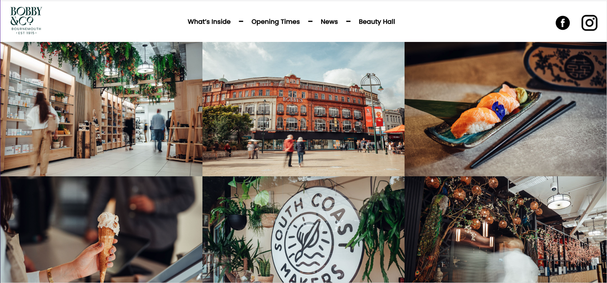

# Bobbys of Bournemouth Website README

## Contents
[Overview](#overview) 
[Deployed Project](#deployed-project) 
[Code Installation](#code-installation) 
[Technologies Used](#technologies-used) 
[Brief](#brief) 
[Process](#process) 
[Bugs](#bugs) 
[Challenges](#challenges) 
[Wins](#wins) 
[Future Improvements](#future-improvements) 
[Key Learning](#key-learning) 

## Overview
This document serves as the README for the Bobbys of Bournemouth website project, detailing its development, features, and deployment.

## Demo 

## Deployed Project
The website is deployed using Netlify. You can view the live site [here]([https://example.com](https://epic-bartik-51a389.netlify.app/)).

## Code Installation
To run the project locally, follow these steps:
1. Clone this repository: `git clone https://github.com/your-username/bobbys-of-bournemouth.git`
2. Navigate to the project directory: `cd bobbys-of-bournemouth`
3. Install dependencies: `npm install`
4. Run the development server: `npm start`
5. Open your browser and visit: `http://localhost:3000`

## Technologies Used
- React
- React Router
- Bulma
- React Image Overlay
- React Responsive Carousel
- React Reveal
- React Scroll Parallax
- Sass

## Brief
The project involves the development of a website for Bobbys of Bournemouth, aiming to showcase their story, offerings, and upcoming events.

## Process
The development process involved...

## Bugs
List of encountered bugs and their resolutions...

## Challenges
Challenges faced during the development process...

## Wins
Achievements and successful outcomes...

## Future Improvements
Plans for future enhancements...

## Key Learning
Key takeaways and lessons learned from the project...
